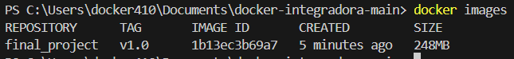

## Pasos para construir y optimizar la imagen Docker

### 1. Ejecute el comando correspondiente para buildear la imagen

```sh
docker build -t final_project:v1.0 .
```

### 2. Elija un nombre de imagen y un tag

- Nombre de la imagen: `final_project`
- Tag: `v1.0`

### 3. Muestre cuánto espacio ocupa la imagen una vez creada

||
|:--:|
| final_project   v1.0      1b13ec3b69a7   5 minutes ago   248MB |

### 4. ¿Puede hacer algo para optimizar o mejorar la imagen?

Sí, se pueden hacer varias optimizaciones para mejorar la imagen Docker.

Una de las modificaciones que se puede hacer es combinar múltiples comandos `RUN` en uno solo. Esto reduce el número de capas en la imagen, lo que puede hacer que la construcción sea más rápida y la imagen resultante sea más pequeña.

En el Dockerfile original, teníamos dos comandos `RUN` separados:

```dockerfile
RUN apk add --no-cache nodejs yarn
RUN yarn install --production
```

Estos comandos se pueden combinar en uno solo de la siguiente manera:

```dockerfile
RUN apk add --no-cache nodejs yarn && \
    yarn install --production
```

Al combinar estos comandos, se reduce el número de capas creadas durante la construcción de la imagen, lo que optimiza tanto el tiempo de construcción como el tamaño final de la imagen.

Finalmente, al hacer uso de la herramienta incorporada a Node.js **npm** podemos saltearnos la instalacion de otros paquetes y saltar directamente a la instalacion de las dependencias. Quedandonos un comando como el siguiente:

```dockerfile
RUN apk add --no-cache nodejs && \
    npm install --only=production
```

Otra optimización sería utilizar una imagen específica de Alpine con Node.js 18 preinstalado. Esto puede simplificar el Dockerfile y reducir el tiempo de construcción y el tamaño de la imagen.

### Ventajas de usar `node:18-alpine`:

- **Simplicidad**: No necesitas instalar Node.js y Yarn manualmente, lo que simplifica el Dockerfile.
- **Optimización del Tamaño**: La imagen `node:18-alpine` es ligera y está optimizada para contener solo lo necesario.
- **Menos Capas**: Al usar una imagen base con Node.js preinstalado, reduces el número de capas en la imagen final, lo que puede mejorar el rendimiento y reducir el tamaño de la imagen.
- **Uso de una Imagen Base Específica**: Al usar `node:18-alpine`, se evita la necesidad de instalar Node.js y Yarn manualmente, lo que simplifica el Dockerfile y reduce el número de capas.

Implementando estas optimizaciones, puedes mejorar significativamente el tiempo de construcción y el tamaño de la imagen Docker.


## Pasos para modificar y actualizar el contenedor

### 1. Ejecución de los comandos necesarios para que la aplicación refleje los cambios
Ejecute los comandos correspondientes para actualizar la imagen y correr la aplicación. Asegúrese de realizar un etiquetado coherente que refleje los cambios realizados en la imagen.
- **Comando para detener el contenedor anterior**:
    ```bash
    docker stop Final_Project
    ```

- **Comando para construir la nueva imagen**:
    ```bash
    docker build -t final_project:v1.5 .
    ```

- **Comando para iniciar la nueva versión de la aplicación**:
    ```bash
    docker run --name Final_Project -d -p 80:80 final_project:v1.5
    ```


### 2. Eliminación del contenedor e imagen anteriores
La versión antigua de la imagen y contenedor ha quedado obsoleta debido a la actualización reciente del código.


### 3. Eliminación de la imagen y el contenedor anteriores
Ejecute los comandos para eliminar la imagen y el contenedor creados previamente. Asegúrese de documentar los comandos utilizados para este proceso.

- **Comandos utilizados**:
    ```bash
    docker rm Final_Project
    docker rmi final_project:v1.0
    ```

### 4. Listado de imágenes y contenedores
Muestre que las imágenes y contenedores antiguos han sido eliminados correctamente listando las imágenes y contenedores disponibles en el sistema.

- **Comandos utilizado**:
    ```bash
    docker ps -a
    docker images
    ```


## Pasos para compartir la app

Para compartir la imagen de la aplicación, utilizaremos la registry de DockerHub.

### 1. Comandos para subir la imagen a DockerHub

Adjunte los comandos necesarios para que sea posible subir la imagen correctamente a DockerHub.

- **Iniciar sesión en DockerHub**:
    ```bash
    docker login
    ```

- **Etiquetar la imagen con el nombre de usuario de DockerHub**:
    ```bash
    docker tag final_project:v1.5 dersoc/final_project:v1.5
    ```

- **Subir la imagen a DockerHub**:
    ```bash
    docker push dersoc/final_project:v1.5
    ```

### 2. Compartir la URL de DockerHub

`https://hub.docker.com/r/dersoc/final_project`

## Pasos para la persistencia de datos

Para asegurar la persistencia de los datos, es necesario utilizar volúmenes en Docker. De esta manera, los datos se guardarán fuera del contenedor, en el sistema de archivos del host, lo que permitirá conservarlos incluso si el contenedor es eliminado o recreado.

### 1. Comandos utilizados y explicación

- **Crear un volumen específico para el archivo de datos** (opcional, pero recomendado para mayor control):
    ```bash
    docker volume create todo_data
    ```
- **Ejecutar el contenedor usando el volumen creado**:
    ```bash
    docker run -d -p 80:80 -v todo_data:/etc/todos dersoc/final_project:v1.5
    ```
    - `-v persistence:/etc/todos`: Este comando monta un volumen. Todo lo que se guarde en el directorio `/etc/todos` dentro del contenedor será guardado en `persistence` en la máquina host.
    - Esto asegura que el archivo `todo.db` se almacene de forma persistente en el sistema de archivos del host.
    En este caso, Docker se encargará de gestionar el volumen `todo_data` y su persistencia, asegurando que los datos permanezcan incluso tras reinicios o eliminación del contenedor.

- **Listar los volúmenes para verificar**:
    ```bash
    docker volume ls
    ```
    


### 3. Tipo de persistencia adecuada para la app

La opción adecuada para esta aplicación es utilizar **volúmenes de Docker**, ya que permiten almacenar los datos en el sistema de archivos del host sin depender de la vida útil del contenedor. Esto es ideal para aplicaciones que manejan archivos pequeños como bases de datos en formato texto (`todo.db`), permitiendo su recuperación incluso si el contenedor es eliminado o recreado.
